```{r setup, include=FALSE}
options(htmltools.dir.version = FALSE)
```

background-image: url(https://www.yworks.com/assets/images/gallery/lastfm_tags_clustered.2da0a224.svg)
background-size: cover


---
# Plan du cours
1. Séance du 28/11/2018
  - Introduction
  - Bases de théorie des graphes
  - Analyse des liens d'un graphe
--

1. **Séance du 03/12/2018**
  - **Clustering des noeuds d'un graphe**
  - **Détection de communautés**
--

1. Séance du 12/12/2018
  - Séance de TD (rendu en fin de séance, $3/8$ de la note finale)
--

1. Séance du 09/01/2019
  - Plongement d'un graphe dans $\mathbb{R}^d$
  - Des approches classiques aux approches par réseaux de neurones (Graph Neural Networks)
--

1. Séance du 16/01/2019
  - Séance de TD (rendu en fin de séance, $3/8$ de la note finale)
  
La présence aux cours compte pour 5 points.  

---
# Some definitions
<div class="definition">
Unsupervised learning: the process of finding relationships in sets of unlabeled or unclassified data.
</div>
<div class="definition">
Clustering: The process of dividing a set of input data into possibly overlapping subsets, where elements in each subset are considered related by some metric.
</div>

Clustering on graphs can take two forms: 
- within-graph: clusters the vertices within an individual graph
- between-graph: clusters a set of graphs, each based on some measure of similarity

---
# Applications of within-graph clustering
- Clustering vertices in social networks: identify people having a similar set of relations or edges, to recommend new relationships.

- Bioinformatics: proteins-proteins interactions can be represented as a graph. Each vertex is a protein and an edge is placed between two vertices if there exists an interaction between them. Clustering vertices in such a graph will help identify those groups of proteins, known as functional modules, that interact as a group to carry out some function in the cell.

.pull-left[

]

.pull-right[

]

---
class: inverse, middle, center
# Minimum Spanning Tree Clustering

---
# Spanning trees
<div class="definition">
Spanning tree: A connected subgraph with no cycles that includes all vertices in the graph.
</div>

.pull-left[
```{r miserables, echo=FALSE, warning=FALSE, message=FALSE, out.width='100%', cache=TRUE}
library(sigmaNet)
library(igraph)
data(lesMis)
layout <- layout_with_fr(lesMis)
sig <- sigmaFromIgraph(lesMis, layout = layout)
sig
```
]

.pull-right[
```{r miserablesMST, echo=FALSE, warning=FALSE, message=FALSE, out.width='100%', cache=TRUE}
library(sigmaNet)
library(igraph)
data(lesMis)
layout <- layout_with_fr(lesMis)
g_mst <- mst(lesMis)
sigMST <- sigmaFromIgraph(g_mst, layout = layout)
sigMST
```
]

---
# Minimum spanning tree
<div class="definition">
Minimum Spanning tree: The spanning tree of a graph with the minimum possible sum of edge weights,
if the edge weights represent distance and maximum possible sum of edge
weights, if the edge weights represent similarity.
</div>

The minimum spanning forest is a generalization of a minimum spanning tree for unconnected graphs.

```{r USairport, echo=FALSE, warning=FALSE, message=FALSE, out.width='35%', dev='svglite', fig.align='center', cache=TRUE}
library(maps)
library(geosphere)
library(dplyr)
library(nycflights13)


usairports <- filter(airports, lat < 48.5)
usairports <- filter(usairports, lon > -130)
usairports <- filter(usairports, faa!="JFK")
jfk <- filter(airports, faa=="JFK")

map("world", regions=c("usa"), fill=T, col="grey8", bg="grey15", ylim=c(21.0,50.0), xlim=c(-130.0,-65.0))


for (i in (1:dim(usairports)[1])) { 

inter <- gcIntermediate(c(jfk$lon[1], jfk$lat[1]), c(usairports$lon[i], usairports$lat[i]), n=200)

lines(inter, lwd=0.1, col="turquoise2")    
}

points(usairports$lon,usairports$lat, pch=3, cex=0.1, col="chocolate1")
```

---
# Properties

**Cut property**. For any cut $\mathcal{C}$ in the graph, if the weight of an edge $e$ of $\mathcal{C}$ is strictly smaller than the weights of all other edges of $\mathcal{C}$, then this edge belongs to all MSTs of the graph. 

.center[

]

**Cycle property**. For any cycle $\mathcal{C}$ in the graph, if the weight of an edge $e$ of $\mathcal{C}$ is larger than the individual weights of all other edges of $\mathcal{C}$, then this edge cannot belong to a MST.

---
# Mono-machine algorithms

.center[

]

.center[

]

---
# Mono-machine algorithms

.pull-left[
.center[

]
.center[Kruskal algorithm]
]

.pull-right[
.center[

]
.center[Prim's algorithm]
]

---
# Multi-machines algorithms
The basic assumption of distributed algorithms is that the vertices of the graph fit in the memory of a single machine, but the edges do not.

<div class="theorem">
Any edge that does not belong to MST of a subgraph containing the edge does not belong to the MST of the original graph.
</div>


---
# Multi-machines algorithms
.center[

]

.center[
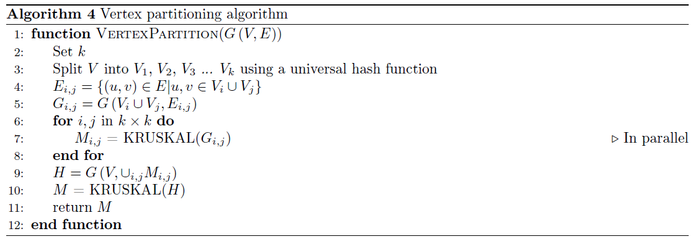
]

---
# Identifying clusters from MST

The minimum spanning tree allows for a simple method of clustering. Since there are no cycles in the graph, the removal of any edge in the spanning tree results in disconnecting the graph, incrementing the total number of connected components in the graph.


Removing $k-1$ edges has the effect of creating $k$ connected components, which form the clusters.


.center[
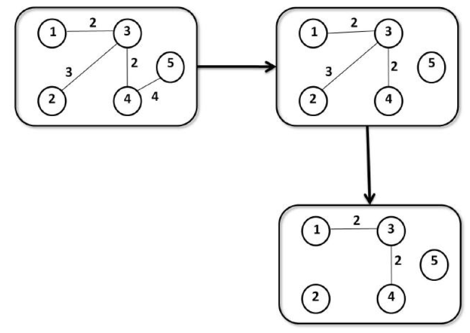
]

---
class: inverse, middle, center
# Finding communities in graphs

---
# Measuring the quality of a community

Let $G(V,E)$ be an undirected graph with $n$ nodes and $m$ edges. Let $S$ be the set of nodes in the cluster, where $|S| = n_S$, $m_S$ the number of edges in $S$, $m_S = | \{ (u,v) : u \in S , v \in S \} |$. Let's define $c_S$ the number of edges in the boundary of $S$, $c_S = | \{ (u,v) : u \in S , v \notin S  \} |$, and $d(u)$ is the degree of node $u$. 

The following metrics are used to capture the quality of a cluster, small values of $f(S)$ are associated with a better community-like set of nodes. 

- **Conductance**: measures the fraction of total edge volume that points outside the cluster.
$$ f(S) = \frac{c_S}{2 m_S + c_S}$$
- **Expansion**: measures the number of edges per
node that point outside the cluster
$$ f(S) = \frac{c_S}{n_S}$$
- **Internal density**: 
$$f(S) = 1 - \frac{m_S}{\frac{n_S(n_S-1)}{2}} $$

---
# Single criterion scores

Modularity is the most widely used method to evaluate the quality of a division into communities. Modularity measures the number of within-community edges, relative to a null model of a random graph with the same degree distribution.

- **Modularity**: 
$$ \frac{1}{4m} (m_S - E(m_S))$$
where $E(m_S)$ is the expected number of edges between the nodes in set $S$ in a random graph with the same node degree sequence.

- **Modularity ratio**: alternative definition of the modularity, where we take the ratio of the number of edges between the nodes of $S$ and the expected number of such edges under the null-model. 
$$ \frac{m_S}{E(m_S)}$$

---
# Network community profile

Proposed in Leskovec et al. (2008), the network community profile plot measures the quality of the best possible community in a large network, as a function of the community size. The quality is measured by the conductance $\Phi(S)$.
$$\Phi(k) = \min_{S \subset V, |S| = k} \Phi(S)$$
We can also express the conductance of $S$, set of nodes in a graph $G$ with adjacency matrix $A$ as
$$\Phi(S) = \frac{\sum_{i \in S, j \notin S } A_{ij}}{\min\{ A(S), A(\bar{S})) \}}$$
where $A(S) = \sum_{i \in S} \sum_{j \in V} A_{ij}$ or equivalently $A(S) = \sum_{i\in S} d(i)$.

---
# Examples
.center[
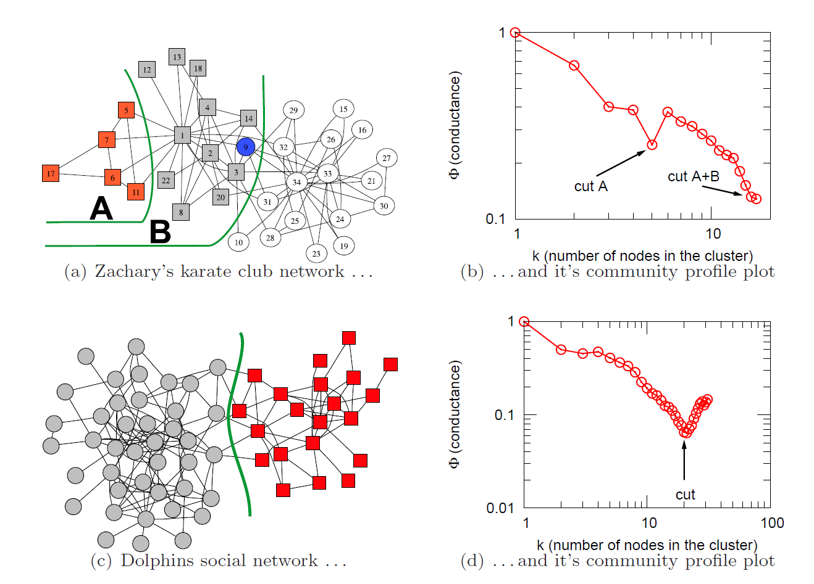
]


---
# Examples
.center[
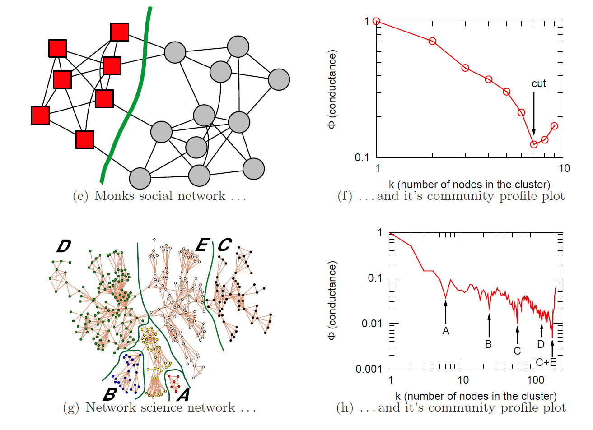
]

---
# Cliques
- A clique is a complete subgraph of the graph.
- A member of a clique is connected to every other member of the same clique.
- Cliques can overlap
- A clique with $n$ members is called a $n$-clique

.center[
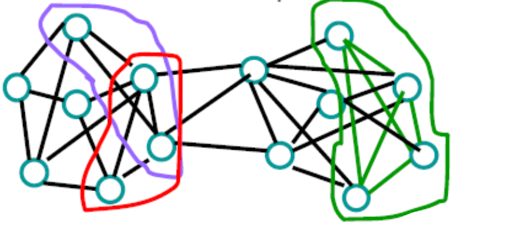
]

<div class="definition">
A maximal clique is a clique that is not part of a larger clique.
</div>

---
# Maximal clique enumeration
There are several algorithms that can enumerate all the maximal cliques in
an input graph $G$, but the most widely-used, efficient, serial method of enumerating
maximal cliques is by Bron and Kerbosch (BK).

.pull-left[
.center[
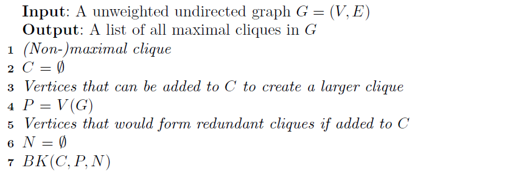
]
.center[Algorithm]
]

.pull-right[
.center[
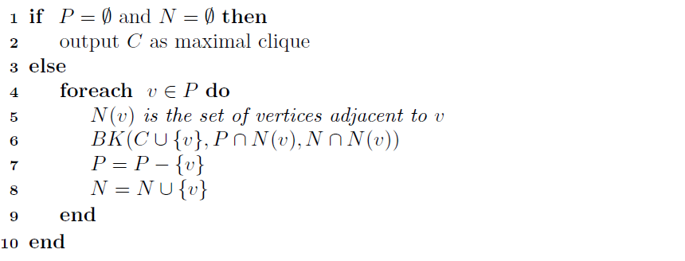
]
.center[BK algorithm]
]

---
# Illustration (1)
```{r cliques, echo=TRUE, eval=TRUE, warning=FALSE, message=FALSE, out.width='35%'}
library(igraph)
g <- sample_gnp(100, 0.3)
clique_num(g)
cliques(g, min=6)
largest_cliques(g)
```


---
# Illustration (2)
```{r cliques2, echo=TRUE, eval=TRUE, warning=FALSE, message=FALSE, out.width='35%'}
library(igraph)
g <- sample_gnp(100, 0.03)
str(max_cliques(g))

```

---
# Cliques as community in real networks

- High computational cost 
$$\mathcal{O}(2^{0.249^n}) = \mathcal{O}(1.1888^n)$$
- Need for a smoother definition


---
# Highly connected subgraph clustering

- Robust to small perturbations of the graph
- If you use communities to recommend films or product, the clusters should be stable to addition and deletion of nodes

**Definition** A cut of a graph $G$, $Cu(G)$ is a set of edges whose removal disconnects a graph $G$.

**Definition** Minimum edge cut $M_{Cu}(G)$ of graph $G$ is a cut with the minimum number of edges.

**Definition** Edge connectivity $EC(G)$ of a graph $G$ is the minimum number of edges whose removal will disconnect a graph $G$, i.e.
$$EC(G) = | M_{Cu}(G) |$$

**Definition** Highly connected subgraph S is defined as a subgraph whose edge connectivity $EC(S)$ exceeds half the number of nodes $V(S)$, i.e. 
$$EC(S)>\frac{V(S)}{2}$$

---
# Illustration
```{r hcs, echo=TRUE, eval=TRUE, warning=FALSE, message=FALSE, out.width='35%', fig.align='center'}
library(igraph)
g <- barabasi.game(100, m=1)
plot(g)
edge_connectivity(g, 100, 1)

```

---
# Illustration
```{r hcs2, echo=TRUE, eval=TRUE, warning=FALSE, message=FALSE, out.width='35%', fig.align='center'}
library(igraph)
g <- barabasi.game(100, m=5)
plot(g)
edge_connectivity(g, 100, 1)

```


---
# Highly connected subgraphs algorithm

.pull-left[
.center[
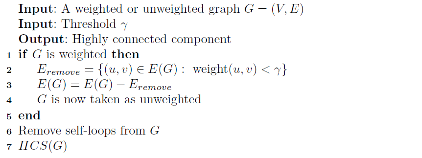
]
.center[Algorithm]
]

.pull-right[
.center[
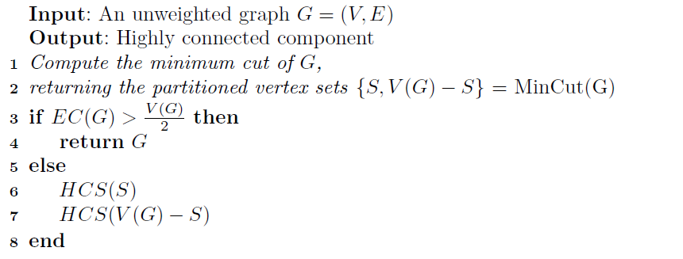
]
.center[HCS algorithm]
.center[
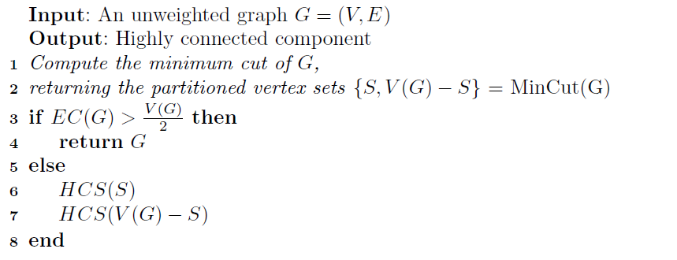
]
.center[HCS(G) algorithm]
]


---
# Betweenness centrality of a vertex

Betweenness centrality of a node $v \in V(G)$ in the graph $G$ is defined as
$$C_b(v) = \sum_{s \neq v, t\neq v} \frac{\Omega_v(s,t)}{\Omega(s,t)}$$
where $\Omega(s,t)$ is the total number of shortest paths from $s$ to $t$, and $\Omega_v(s,t)$ is the total number of shortest paths from $s$ to $t$ going through $v$.
.center[

]


---
# Betweenness centrality of an edge

Betweenness centrality of an edge $(u,v) \in E(G)$ in the graph $G$ is defined as
$$C_b(u,v) = \sum_{s \neq t} \frac{\Omega_{u,v}(s,t)}{\Omega(s,t)}$$
.center[
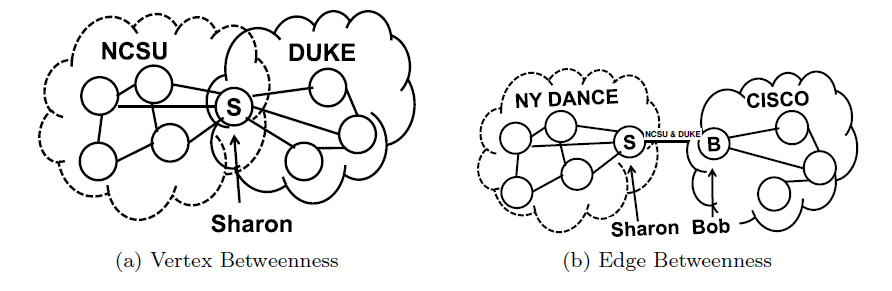
]

---
# Edge betweenness centrality clustering
.center[
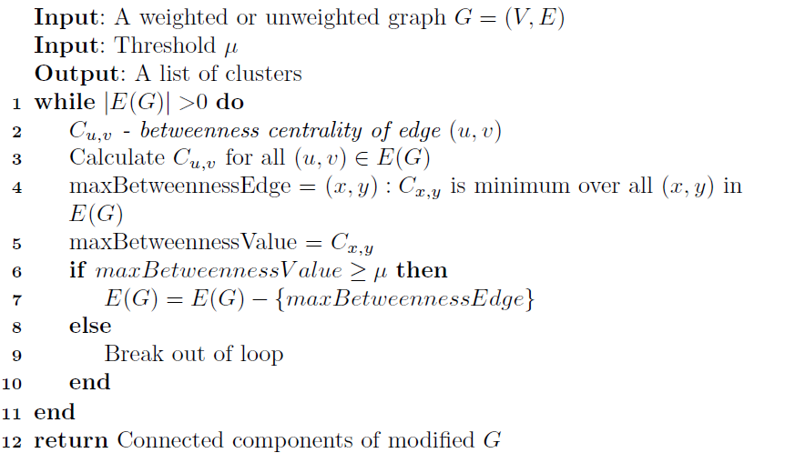
]

---
# Other community detection algorithms
To be tested during the practical session:
1. Optimal modularity: The performance of modularity maximization in practical contexts.
B. H. Good, Y.-A. de Montjoye and A. Clauset.
Physical Review E 81, 046106 (2010)
1. Leading eigenvector: Finding community structure in networks using the eigenvectors of matrices
MEJ Newman
Phys Rev E 74:036104 (2006)
1. Fast-greedy: Finding community structure in very large networks
Aaron Clauset, M. E. J. Newman, Cristopher Moore
1. Multi-level: Fast unfolding of communities in large networks
Vincent D. Blondel, Jean-Loup Guillaume, Renaud Lambiotte, Etienne Lefebvre
1. Walktrap: Computing communities in large networks using random walks
Pascal Pons, Matthieu Latapy
1. Label propagation: Near linear time algorithm to detect community structures in large-scale networks.
Raghavan, U.N. and Albert, R. and Kumara, S.
Phys Rev E 76, 036106. (2007)
1. Infomap: The map equation
M. Rosvall, D. Axelsson, C. T. Bergstrom


