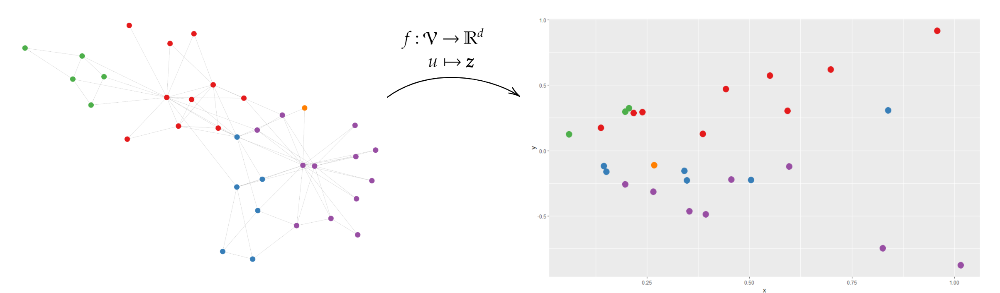
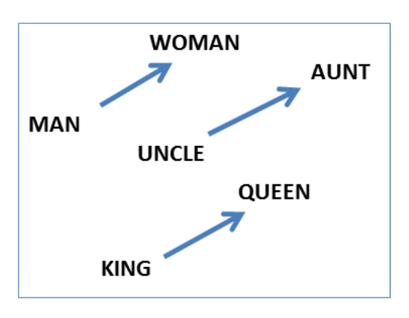

```{r setup, include=FALSE}
options(htmltools.dir.version = FALSE)
```
# Plan du cours
1. Séance du 28/11/2018
  - Introduction
  - Bases de théorie des graphes
  - Analyse des liens d'un graphe
--

1. Séance du 03/12/2018
  - Clustering des noeuds d'un graphe
  - Détection de communautés
--

1. Séance du 12/12/2018
  - Séance de TD (rendu en fin de séance, $3/8$ de la note finale)
--

1. **Séance du 09/01/2019**
  - **Plongement d'un graphe dans $\mathbb{R}^d$**
  - **Des approches classiques aux approches par réseaux de neurones (Graph Neural Networks)**
--

1. Séance du 16/01/2019
  - Séance de TD (rendu en fin de séance, $3/8$ de la note finale)
  
La présence aux cours compte pour 5 points.  

---
# Classical machine learning tasks for networks

Let's consider a graph $\mathcal{G} = (\mathcal{V}, \mathcal{E})$. Its adjacency matrix is denoted 
$A \in \mathbb{R}^{|\mathcal{V}| \times |\mathcal{V}| }$. We also have some information about the nodes, gathered 
in a feature matrix $X \in \mathbb{R}^{m \times |\mathcal{V}|}$. 

Classical machine learning tasks dealing with such graphs include:

- **Node classification**
  * Predict a type of a given node  

- **Link prediction**
  * Predict whether two nodes are linked

- **Community detection**
  * Identify densely linked clusters of nodes

- **Network similarity**
  * Evaluate a distance/similarity between two (sub)graphs

---
# Embedding in networks

What can we embed in networks?

.center[

]

In this course, we will mainly focus on node embedding (and marginally subgraph embedding). Given a node 
$v_i \in \mathcal{V}$, we want to find a vector $\boldsymbol{z_i} \in \mathbb{R}^{d}$ using information provided by $A$ and $X$. 




```{r, echo=FALSE, eval=FALSE}
library(igraph)
library(sigmaNet)
library(RColorBrewer)
library(data.table)
library(ggplot2)
gg <- make_graph("zachary")

clust <- cluster_edge_betweenness(gg)$membership
V(gg)$group <- clust

layout <- layout_with_fr(gg)

sig <- sigmaFromIgraph(gg, layout = layout) %>%
  addEdgeSize(oneSize = 0.2) %>%
  addNodeSize(oneSize = 7) %>%
  addNodeColors(colorAttr = 'group', colorPal = 'Set1')
sig
mycoords <- as.data.table(embed_adjacency_matrix(gg, no=2)$X)
mycoords[, color:=brewer.pal(max(clust), "Set1")[vertex_attr(gg,"group")]]
colnames(mycoords) <- c("x","y","col")
ggplot(mycoords, aes(x,y)) + geom_point(colour=mycoords$col, size=5)
```

---
# Applications related to node embedding

- **Node classification**: Node classification aims at labelling nodes based on the statistical properties learnt from labelled nodes of the graph. Node classification is conducted by applying a classifier on the set of labelled node embedding for training.

- **Node clustering**: group similar nodes together. This is usually performed using a classical unsupervised algorithm such as $k$-means on node coordinates in embedded space.

- **Node recommendation/retrieval/ranking**: the problem consists in recommending top K nodes of interest. Typical use cases include items for customers, friends for social network users, or documents for queries.

.center[

]

---
# Edge related applications

- **Link prediction**: Graphs are incomplete, such that in social networks, friendship links can be missing between two users who actually know each other. Many graph embedding techniques preserve different orders of proximity (to be defined later), hence the embedded vectors encode rich information about the structure of the network.  

- **Triplet classification**: It aims to
classify whether an unseen triplet $< h, r, t >$ is correct or
not, i.e., whether the relation between $h$ and $t$ is $r$. 

.center[

]

---
# Graph related applications

- **Graph classification**: graph classification tasks assign a class label to the whole graph. For example each graph can represent a chemical compound, an organic molecule or a protein structure. 

- **Visualization**: Graph visualization generates visualizations of a graph on
a low dimensional space (usually 2d or 3d).


---
class: inverse, center, middle

# Shallow Node Embeddings

---
# Embedding nodes

The goal is to *encode* nodes so that *similarity in the embedding space* approximates *similarity in the original network*.


---
# Embedding nodes


---
# Learning node embedding

1. A pairwaise similarity function $s_\mathcal{G} : \mathcal{V} \times \mathcal{V} \mapsto \mathbb{R}^+$. This function measures the similarity between nodes in $\mathcal{G}$.

1. An encoder function, which generates the embeddings. This function contains a number of trainable parameters that are optimized during the training phase.

1. A decode function, which constructus pairwaise similarity values from the generated embeddings (usually not trainable).

1. A loss function $\mathcal{l}$, which defines a way to train the model, i.e. evaluates how $\mathrm{DEC}(\mathbf{z}_i, \mathbf{z}_j)$ is compared to the true $s_{\mathcal{G}(v_i, v_j)}$.

---
# Shallow encoding
- Simplest encoding approach: encoder is just an embedding-lookup 

$$ \mathrm{ENC}(v) = \mathbf{Z} \mathbf{v}$$

where 
- $\mathbf{Z} \in \mathbb{R}^{d \times |\mathcal{V}|}$: matrix, each column is node embedding

- $\mathbf{v} \in \mathbb{I}^{|\mathcal{V}|}$ indicator vector, all zeroes except a one in column indicating node $v$.


---
# How to define node similarity

- The key distinction between shallow methods is how they define node similarity.

- For example, should two nodes have similar embeddings if they:
  - are connected?
  - share neighbors?
  - have similar structural roles?
  
---
# Adjacency-based similarity

**The cost function** $\mathcal{L}$ is:

$$\sum_{(u, v) \in \mathcal{V} \times \mathcal{V} } ||\mathbf{z}_u^T \mathbf{z}_v - \mathbf{A}_{u,v}||$$ 

- Similarity function is just the edge weight between $u$ and $v$ in the original network. 

- Intuition: dot product between node embeddings approximate edge existence.

**How to solve this problem:**

1. Use stochastic gradient descent (SGD) as a general optimization method.
  - Highly scalable, general approach

2. Option 2: Use matrix decomposition solvers (e.g., SVD or QR decomposition routines).

**Drawbacks**
- runtime $\mathcal{O}(|V|^2)$
- $\mathcal{O}(|V|)$ parameters
- Only considers direct, local connections

---
# Multi-hop similarity


**The cost function** $\mathcal{L}$ is:

$$\sum_{(u, v) \in \mathcal{V} \times \mathcal{V} } ||\mathbf{z}_u^T \mathbf{z}_v - \mathbf{A}_{u,v}^k||$$ 

- Train embeddings to predict $k$-hop neighbors.
- In practice, train different hop lengths and concatenate output.
- Another option: measure overlap between node neighborhoods (Jaccard similarity).


---
# Another option

- Let's consider the similarity between nodes $u$ et $v$ as the probability that $u$ et $v$ co-occur on a random walk over the network.

**Strategy**
1. Estimate probability of visiting
node $v$ on a random walk
starting from node $u$ using
some random walk strategy $R$.

1. Optimize embeddings to
encode these random walk
statistics.

**Detailed steps**
1. Run short random walks starting from each
node on the graph using some strategy $R$.

1. For each node $u$ collect $N_R(u)$, the multiset
of nodes visited on random walks starting
from $u$.

1. Optimize embeddings to according to the cost function $$\sum_{u \in \mathcal{V}} \sum_{v \in N_R(u)}  -\log (\mathbb{P}(v | \mathbf{z}_u))$$ 

---
# Random walk optimization

Cost function $$\sum_{u \in \mathcal{V}} \sum_{v \in N_R(u)}  -\log (\mathbb{P}(v | \mathbf{z}_u))$$

- Intuition: optimize embeddings to maximize likelihood of random walk co-occurences.

- Parameterize $\mathbb{P}(v | \mathbf{z}_u)$ using softmax 
$$\mathbb{P}(v | \mathbf{z}_u) = \frac{\exp (z_u^T z_v)}{\sum_n\exp (z_u^T z_n)} $$


---
# Basic strategies


---
# Drawbacks of the shallow  approaches 

- **Parameters sharing** No parameters are shared between nodes in the encoder (i.e., the encoder is simply an embedding lookup
based on arbitrary node ids). This can be statistically inefficient, since parameter sharing can act as a
powerful form of regularization, and it is also computationally inefficient, since it means that the number
of parameters in shallow embedding methods necessarily grows as $O(|V|)$.

- **No simple way to incorporate node features**: Shallow embedding also fails to leverage node attributes during encoding. In many large graphs nodes
have attribute information (e.g., user profiles on a social network) that is often highly informative with
respect to the node’s position and role in the graph.

- **TRansductive versus inductive learning**: Shallow embedding methods are inherently transductive, i.e., they can only generate embeddings for
nodes that were present during the training phase, and they cannot generate embeddings for previously
unseen nodes unless additional rounds of optimization are performed to optimize the embeddings for
these nodes. This is highly problematic for evolving graphs, massive graphs that cannot be fully stored in
memory, or domains that require generalizing to new graphs after training.

---
class: inverse, center, middle

# Deep Node Embeddings

---
class: inverse, center, middle

# Embedding Subgraphs

---
# The graph isomorphism problem

Weisfeiler-Lehman graph isomorphism test

---
class: inverse, center, middle

#Challenges and Future Directions

---
#Challenges and future directions
- Scalability
- Decoding higher-order motifs
- Modelling dynamic, temporal graphs
- Improving interpretability

---
# Bibliography (1/6)
1. Ahmed, Amr, Nino Shervashidze, Shravan Narayanamurthy, Vanja Josifovski, and Alexander J. Smola. 2013. *Distributed Large-Scale Natural Graph Factorization.* In Proceedings of the 22Nd International Conference on World Wide Web, 37–48. WWW ’13. New York, NY, USA: ACM. https://doi.org/10.1145/2488388.2488393.

1. Allamanis, Miltiadis, Marc Brockschmidt, and Mahmoud Khademi. 2017. *Learning to Represent Programs with Graphs.* ArXiv:1711.00740 [Cs], November. http://arxiv.org/abs/1711.00740.

1. Bojchevski, Aleksandar, and Stephan Günnemann. 2017. *Deep Gaussian Embedding of Graphs: Unsupervised Inductive Learning via Ranking.* ArXiv:1707.03815 [Cs, Stat], July. http://arxiv.org/abs/1707.03815.

1. Bronstein, Michael M., Joan Bruna, Yann LeCun, Arthur Szlam, and Pierre Vandergheynst. 2017. *Geometric Deep Learning: Going beyond Euclidean Data.* IEEE Signal Processing Magazine 34 (4): 18–42. https://doi.org/10.1109/MSP.2017.2693418.

1. Cai, Hongyun, Vincent W. Zheng, and Kevin Chen-Chuan Chang. 2017. *A Comprehensive Survey of Graph Embedding: Problems, Techniques and Applications.* ArXiv:1709.07604 [Cs], September. http://arxiv.org/abs/1709.07604.

---
# Bibliography (2/6)

1. Cao, Shaosheng, Wei Lu, and Qiongkai Xu. 2016. *Deep Neural Networks for Learning Graph Representations.* In Proceedings of the Thirtieth AAAI Conference on Artificial Intelligence, 1145–1152. AAAI’16. Phoenix, Arizona: AAAI Press. http://dl.acm.org/citation.cfm?id=3015812.3015982.

1. Chen, Zhengdao, Xiang Li, and Joan Bruna. 2017. *Supervised Community Detection with Line Graph Neural Networks.* ArXiv:1705.08415 [Stat], May. http://arxiv.org/abs/1705.08415.

1. Dai, Hanjun, Zornitsa Kozareva, Bo Dai, Alex Smola, and Le Song. 2018. *Learning Steady-States of Iterative Algorithms over Graphs.* In International Conference on Machine Learning, 1106–14. http://proceedings.mlr.press/v80/dai18a.html.

1. Defferrard, Michaël, Xavier Bresson, and Pierre Vandergheynst. 2016. *Convolutional Neural Networks on Graphs with Fast Localized Spectral Filtering.* ArXiv:1606.09375 [Cs, Stat], June. http://arxiv.org/abs/1606.09375.

1. Duvenaud, David, Dougal Maclaurin, Jorge Aguilera-Iparraguirre, Rafael Gómez-Bombarelli, Timothy Hirzel, Alán Aspuru-Guzik, and Ryan P. Adams. 2015. *Convolutional Networks on Graphs for Learning Molecular Fingerprints.* ArXiv:1509.09292 [Cs, Stat], September. http://arxiv.org/abs/1509.09292.


---
# Bibliography (3/6)

1. Hamilton, William L., Rex Ying, and Jure Leskovec. 2017a. *Inductive Representation Learning on Large Graphs,* June. https://arxiv.org/abs/1706.02216v4.

1. Hamilton, William L., Rex Ying, and Jure Leskovec. 2017b. *Representation Learning on Graphs: Methods and Applications.* ArXiv:1709.05584 [Cs], September. http://arxiv.org/abs/1709.05584.

1. Kipf, Thomas N., and Max Welling. 2016a. *Semi-Supervised Classification with Graph Convolutional Networks.* ArXiv:1609.02907 [Cs, Stat], September. http://arxiv.org/abs/1609.02907.

1. Kipf, Thomas N., and Max Welling. 2016b. *Variational Graph Auto-Encoders.* ArXiv:1611.07308 [Cs, Stat], November. http://arxiv.org/abs/1611.07308.

1. Li, Yujia, Daniel Tarlow, Marc Brockschmidt, and Richard Zemel. 2015. *Gated Graph Sequence Neural Networks.* ArXiv:1511.05493 [Cs, Stat], November. http://arxiv.org/abs/1511.05493.

---
# Bibliography (4/6)

1. Monti, Federico, Davide Boscaini, Jonathan Masci, Emanuele Rodolà, Jan Svoboda, and Michael M. Bronstein. 2016. *Geometric Deep Learning on Graphs and Manifolds Using Mixture Model CNNs.* ArXiv:1611.08402 [Cs], November. http://arxiv.org/abs/1611.08402.

1. Paranjape, Ashwin, Austin R. Benson, and Jure Leskovec. 2017. *Motifs in Temporal Networks.* Proceedings of the Tenth ACM International Conference on Web Search and Data Mining - WSDM ’17, 601–10. https://doi.org/10.1145/3018661.3018731.

1. Scarselli, Franco, Marco Gori, Ah Chung Tsoi, Markus Hagenbuchner, and Gabriele Monfardini. 2009. *The Graph Neural Network Model.* Trans. Neur. Netw. 20 (1): 61–80. https://doi.org/10.1109/TNN.2008.2005605.

1. Schlichtkrull, Michael, Thomas N. Kipf, Peter Bloem, Rianne van den Berg, Ivan Titov, and Max Welling. 2017. *Modeling Relational Data with Graph Convolutional Networks.* ArXiv:1703.06103 [Cs, Stat], March. http://arxiv.org/abs/1703.06103.

1. Sevi, Harry, Gabriel Rilling, and Pierre Borgnat. 2018. *Harmonic Analysis on Directed Graphs and Applications: From Fourier Analysis to Wavelets.* ArXiv:1811.11636 [Math, Stat], November. http://arxiv.org/abs/1811.11636.

---
# Bibliography (5/6)

1. Tian, Fei, Bin Gao, Qing Cui, Enhong Chen, and Tie-Yan Liu. 2014. *Learning Deep Representations for Graph Clustering.* In Proceedings of the Twenty-Eighth AAAI Conference on Artificial Intelligence, 1293–1299. AAAI’14. Québec City, Québec, Canada: AAAI Press. http://dl.acm.org/citation.cfm?id=2893873.2894074.

1. Veličković, Petar, Guillem Cucurull, Arantxa Casanova, Adriana Romero, Pietro Liò, and Yoshua Bengio. 2017. *Graph Attention Networks.* ArXiv:1710.10903 [Cs, Stat], October. http://arxiv.org/abs/1710.10903.

1. Wang, Daixin, Peng Cui, and Wenwu Zhu. 2016. *Structural Deep Network Embedding.* In Proceedings of the 22Nd ACM SIGKDD International Conference on Knowledge Discovery and Data Mining, 1225–1234. KDD ’16. New York, NY, USA: ACM. https://doi.org/10.1145/2939672.2939753.

1. Xu, Keyulu, Weihua Hu, Jure Leskovec, and Stefanie Jegelka. 2018. *How Powerful Are Graph Neural Networks?,* September. https://openreview.net/forum?id=ryGs6iA5Km.

1. Ying, Rex, Ruining He, Kaifeng Chen, Pong Eksombatchai, William L. Hamilton, and Jure Leskovec. 2018. *Graph Convolutional Neural Networks for Web-Scale Recommender Systems.* Proceedings of the 24th ACM SIGKDD International Conference on Knowledge Discovery & Data Mining  - KDD ’18, 974–83. https://doi.org/10.1145/3219819.3219890.

---
# Bibliography (6/6)

1. Zhang, Ziwei. 2018. *A Note on Spectral Clustering and SVD of Graph Data.* ArXiv:1809.11029 [Cs], September. http://arxiv.org/abs/1809.11029.

1. Zhang, Ziwei, Peng Cui, and Wenwu Zhu. 2018. *Deep Learning on Graphs: A Survey.* ArXiv:1812.04202 [Cs, Stat], December. http://arxiv.org/abs/1812.04202.

1. Zhou, Jie, Ganqu Cui, Zhengyan Zhang, Cheng Yang, Zhiyuan Liu, and Maosong Sun. 2018. *Graph Neural Networks: A Review of Methods and Applications.* ArXiv:1812.08434 [Cs, Stat], December. http://arxiv.org/abs/1812.08434.

